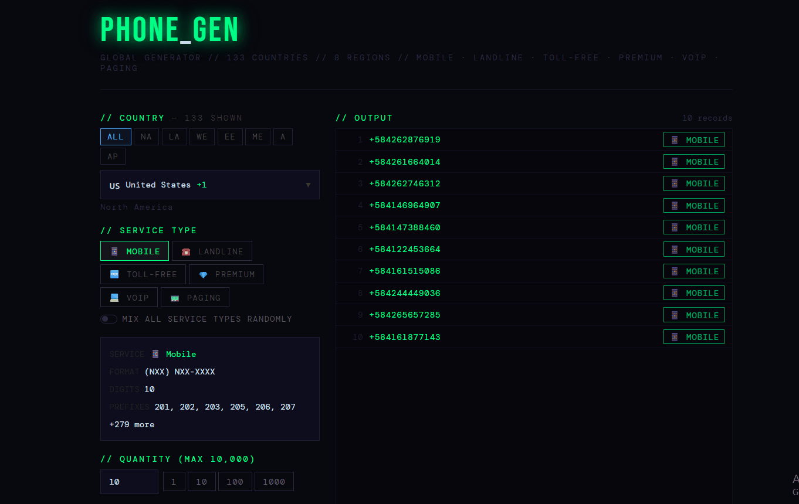
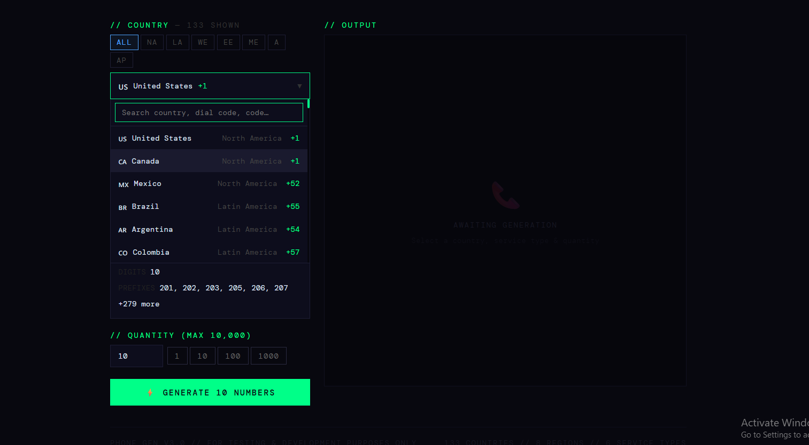
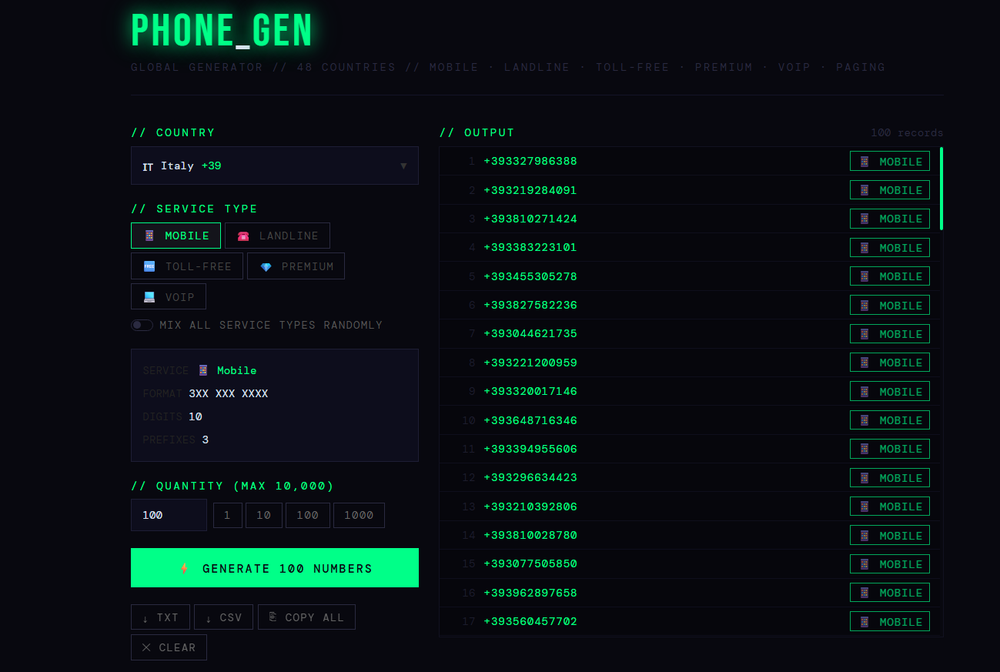
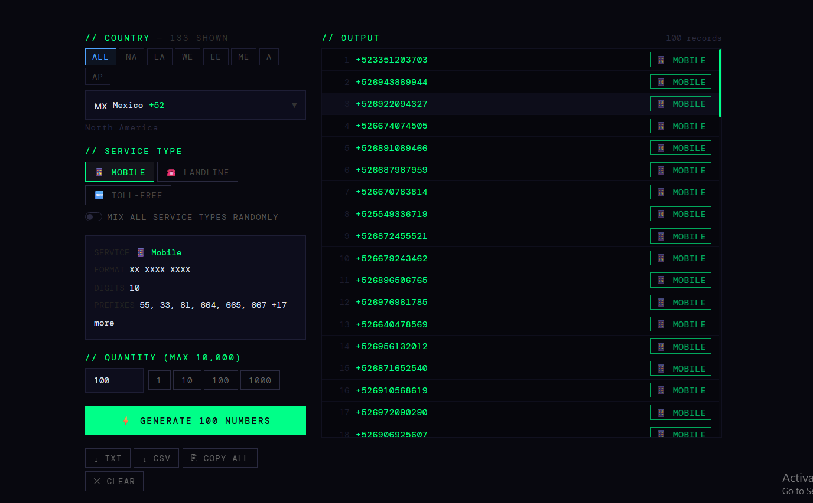

# 📱 Phone_Gen

> A global phone number generator for developers and testers — supporting 150+ countries, 8 regions and 6 service types.



---

## 🌍 Overview

**Phone_Gen** is a dev tool that generates realistic phone numbers for any country in the world. Built for QA testing, database seeding, and development environments where real phone numbers shouldn't be used.

---

## ✨ Features

- 🌐 **150+ countries** with accurate dial codes, formats and digit lengths
- 🗺️ **8 regions** — North America, Latin America, Western Europe, Eastern Europe, Middle East, Africa, Asia Pacific
- 📋 **6 service types** — Mobile, Landline, Toll-Free, Premium, VoIP, Paging
- 🔍 **Region filter** to quickly narrow down the country dropdown
- ⚡ **Bulk generation** — up to 10,000 numbers at once
- 🔀 **Mix mode** — randomly blend all service types in one batch
- 📊 **Breakdown panel** — visual bar chart of generated number types
- 💾 **Export to TXT or CSV** with country, region and service metadata
- ⎘ **Copy to clipboard** in one click
- 🖥️ Clean terminal-inspired dark UI

---

## 🖼️ Screenshots

| Country Selector | Bulk Generation | Export |
|---|---|---|
|  |  |  |

---

## 🗺️ Supported Regions & Countries

| Region | Countries |
|---|---|
| 🌎 North America | United States, Canada, Mexico |
| 🌎 Latin America | Brazil, Argentina, Colombia, Chile, Peru, Venezuela, Ecuador, Bolivia, Paraguay, Uruguay, Cuba, Dominican Republic, Guatemala, Costa Rica, Panama, Jamaica, Trinidad and Tobago, Honduras, El Salvador, Nicaragua |
| 🌍 Western Europe | United Kingdom, France, Germany, Spain, Italy, Netherlands, Belgium, Sweden, Norway, Denmark, Finland, Switzerland, Austria, Portugal, Ireland, Greece, Luxembourg, Malta, Iceland, Cyprus |
| 🌍 Eastern Europe | Russia, Poland, Ukraine, Romania, Czech Republic, Hungary, Bulgaria, Serbia, Croatia, Slovakia, Belarus, Moldova, Albania, Bosnia and Herzegovina, North Macedonia, Slovenia, Estonia, Latvia, Lithuania |
| 🌍 Middle East | Saudi Arabia, UAE, Israel, Turkey, Iran, Iraq, Jordan, Lebanon, Kuwait, Qatar, Bahrain, Oman, Yemen, Syria, Palestine |
| 🌍 Africa | Nigeria, South Africa, Kenya, Egypt, Ethiopia, Tanzania, Ghana, Uganda, Morocco, Algeria, Tunisia, Cameroon, Ivory Coast, Senegal, Angola, Mozambique, Madagascar, Zambia, Zimbabwe, Rwanda, Botswana, Namibia, Mali, Burkina Faso, Sudan, Liberia |
| 🌏 Asia Pacific | China, India, Japan, South Korea, Australia, Indonesia, Pakistan, Bangladesh, Vietnam, Thailand, Malaysia, Philippines, Singapore, New Zealand, Sri Lanka, Nepal, Myanmar, Cambodia, Taiwan, Hong Kong, Macau, Mongolia, Kazakhstan, Uzbekistan, Azerbaijan, Georgia, Armenia, Kyrgyzstan, Papua New Guinea, Fiji |

---

## 📋 Supported Service Types

| Type | Icon | Description | Example |
|---|---|---|---|
| Mobile | 📱 | Cellular numbers with real carrier prefixes | `+1 917 XXX XXXX` |
| Landline | ☎️ | Geographic area-code fixed lines | `+44 20 XXXX XXXX` |
| Toll-Free | 🆓 | Free-to-call 800/1800 numbers | `+1 800 XXX XXXX` |
| Premium | 💎 | Pay-per-call 900 rate numbers | `+1 900 XXX XXXX` |
| VoIP | 💻 | Internet-based phone numbers | `+33 9X XX XX XX` |
| Paging | 📟 | Pager/beeper numbers | `+1 638 XXX XXXX` |

---

## 🛠️ Tech Stack

| Tool | Purpose |
|---|---|
| [React](https://react.dev) | UI framework |
| [Vite](https://vitejs.dev) | Build tool & dev server |
| JavaScript (ES6+) | Core logic |
| CSS-in-JS | Styling |

---

## 🚀 Getting Started

### Prerequisites
- [Node.js](https://nodejs.org) v16 or higher
- npm (comes with Node.js)

### Installation

```bash
# Clone the repository
git clone https://github.com/RachidBoutaguiout/Phone_gen.git

# Navigate into the project
cd Phone_gen

# Install dependencies
npm install

# Start the development server
npm run dev
```

Then open [http://localhost:5173](http://localhost:5173) in your browser.

### Build for Production

```bash
npm run build
```

Output will be in the `dist/` folder, ready to deploy.

---

## 📖 How to Use

1. **Filter by region** using the region buttons to narrow down the list
2. **Select a country** from the searchable dropdown
3. **Choose a service type** — Mobile, Landline, Toll-Free, Premium, VoIP, or Paging
4. **Set the quantity** — type a number or use the quick-select buttons (1 / 10 / 100 / 1000)
5. **Toggle Mix mode** to generate numbers across all service types randomly
6. **Click Generate** ⚡
7. **Export** as `.txt` or `.csv`, or copy all to clipboard

---

## 📁 Project Structure

```
phone-gen/
├── public/
├── src/
│   ├── App.jsx        # Main component — all logic + UI + country data
│   ├── main.jsx       # React entry point
│   └── index.css      # Global reset styles
├── screenshots/
│   ├── screenshot-1.png
│   ├── screenshot-2.png
│   └── screenshot-3.png
├── demo.gif
├── index.html
├── vite.config.js
└── README.md
```

---

## ⚠️ Disclaimer

> All generated phone numbers are **synthetic and randomly generated** for testing and development purposes only. They do not represent real people or active phone lines. Do not use for spam, fraud, or any malicious activity.

---

## 📄 License

This project is licensed under the **MIT License**.

```
MIT License

Copyright (c) 2026 Rachid Boutaguiout

Permission is hereby granted, free of charge, to any person obtaining a copy
of this software and associated documentation files (the "Software"), to deal
in the Software without restriction, including without limitation the rights
to use, copy, modify, merge, publish, distribute, sublicense, and/or sell
copies of the Software, and to permit persons to whom the Software is
furnished to do so, subject to the following conditions:

The above copyright notice and this permission notice shall be included in all
copies or substantial portions of the Software.

THE SOFTWARE IS PROVIDED "AS IS", WITHOUT WARRANTY OF ANY KIND, EXPRESS OR
IMPLIED, INCLUDING BUT NOT LIMITED TO THE WARRANTIES OF MERCHANTABILITY,
FITNESS FOR A PARTICULAR PURPOSE AND NONINFRINGEMENT. IN NO EVENT SHALL THE
AUTHORS OR COPYRIGHT HOLDERS BE LIABLE FOR ANY CLAIM, DAMAGES OR OTHER
LIABILITY, WHETHER IN AN ACTION OF CONTRACT, TORT OR OTHERWISE, ARISING FROM,
OUT OF OR IN CONNECTION WITH THE SOFTWARE OR THE USE OR OTHER DEALINGS IN THE
SOFTWARE.
```

---

<p align="center">Built with ❤️ by <a href="https://github.com/RachidBoutaguiout">Rachid Boutaguiout</a></p>
